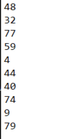
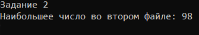
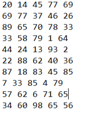
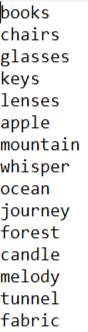
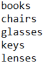
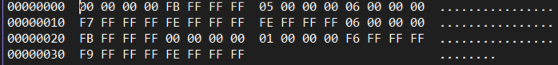
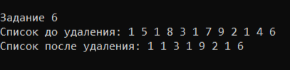
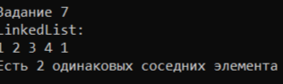
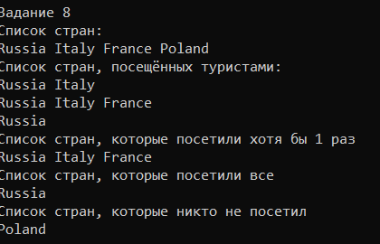

# Ившин Артём КМБ Лабораторная №6

## Задача 1

### Текст задачи
Для заданного файла возвратить true, если он не содержит нуля, и false в противном случае.
### Алгоритм решения
Сначала заполняем файл
1) Открываем файл и запысываем случайное число по одному в строке от minValue до MaxValue, повторяем это count раз
2) Открываем файл и читаем строки
3) Переводим её в число
4) Если это число 0, возвращаем false
5) Проходим до конца файлы
6) Если дошли до конца, значит 0 не было, поэтому возвращаем true
### Тестирование

## Задача 2

### Текст задачи
Вычислить максимальный элемент
### Алгоритм решения
Сначала заполняем файл
1) Открываем файл и запысываем случайные числа от minValue до MaxValue row раз по line строк
2) Инициируем переменную для максимального числа как минимальное возможное число
3) Открываем файл и читаем строки
4) Переводим строку 
5) Переводим с помощью Split(" ") строку в массив чисел
6) Проходимся циклом по массиву
7) Если максимальное число меньше текущего, теперь максимум текущее число
8) Возвращаем максимальное число в качестве ответа
### Тестирование

## Задача 3

### Текст задачи
Переписать в другой файл строки, оканчивающиеся на заданный символ
### Алгоритм решения
1) Открываем файл для чтения, откуда берём слова, и файл для запись, куда будем записывать ответ
2) Читаем строки у файла для чтения
3) Если строка оканчивается на заданный символ, то записываем это слово в файл для записи
### Тестирование

## Задача 4

### Текст задачи
Подсчитать количество пар противоположных чисел среди компонент исходного файла.
### Алгоритм решения
Сначала заполняем бинарный файл
1) Открываем бинарный файл и запысываем случайное число по одному в строке от minValue до MaxValue, повторяем это count раз
2) Создаём словарь, где ключ - само число, а значение - сколько раз это число встречалось
3) Открываем бинарный файл и читаем от туда числа
4) Если в словаре есть противоположное число и значение в словаре у этого числа > 0, то результат увеличиваем на 1
5) Если нет числа, то добавляем это число
6) Если число есть, но с ним невозможно составить мару, тьо значение в словаре у этого числа увеличиваем на 1
7) Возвращаем результат
### Тестирование

## Задача 6

### Текст задачи
Составить программу, которая удаляет из списка L за каждым вхождением элемента E один элемент, если такой есть, и он отличен от E
### Алгоритм решения
1) Если список равен null или его размер < 2, то ничего со списком не делаем
2) Проходим по списку list.Count - 1 раз и сравниваем текущий элемент с заданным
3) Если эти элементы равны и если текущий индекс <= list.Count
4) И Если следующий элемент не равен заданному, то удаляем этот элемент из списка
### Тестирование

## Задача 7

### Текст задачи
Из списка L, содержащего не менее двух элементов, удалить все элементы, у которых одинаковые «соседи» (первый и последний элементы считать соседями).
### Алгоритм решения
1) Если список равен null или его размер равен 0, то возвращаем false
2) Если список равен 1, то возвращаем true
3) Если первый элемент списка равен последнему, то возвращаем true
4) проходимся по списку list.Count - 1 раз 
5) Берём текущию ноду и сравниваем её со следующей
6) Если они равны, возвращаем true
7) Приравниваем текущую ноду к следующей (чтобы двигаться дальше по списку)
8) Если прошлись по всему списку и не нашли равные элементы, то возвращаем false
### Тестирование

## Задача 8

### Текст задачи
Есть перечень стран, популярных у туристов. Определить для каждой страны, какие из нихпосетили все n туристов, какие — некоторые из туристов, и какие — никто из туристов.
### Алгоритм решения
1) Для поиска стран, которые посетили хотя бы один раз, выбираем hashset
2) Проходимся по всем туристам и объединяем множества hashset исходный с hashset у туриста
3) Для поиска стран, которые посетили все, выбираем hashset
4) Проходимся по всем туристам и берём пересечение множества hashset исходный с hashset у туриста
5) Для поиска стран, которые никто не посетил, выбираем hashset
6) Вычитаем из множеста всех стран страны, которые посетили хотя бы раз, и получаем необходимое множество
### Тестирование
